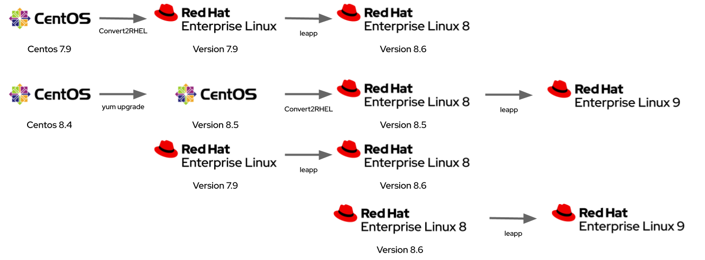

= leapp2rhel
Centos to RHEL demo with additional upgrade step

This leverages two key Red Hat projects in addition to our
https://www.redhat.com/Ansible[Ansible] automation

 - https://github.com/oamg/convert2rhel[Convert2RHEL]
 - https://github.com/oamg/leapp[Leapp]

== Demo Overview

This demo migrates standard cloud Centos images to recent releases of https://www.redhat.com/en/technologies/linux-platforms/enterprise-linux[Red Hat Enterprise Linux], or can be used to show in-place upgrades between versions of RHEL.

There are additional demo flows that include the Cockpit web console, our Red Hat Insights capability, and our Image Builder SaaS offering.

 

== Demo Steps

Here are the setps you can follow to reproduce this demo - 

- Deploy a link:docs/Demo_VM.adoc[local or cloud hosted Centos Linux environment]
- Convert link:docs/Demo_Convert2RHEL.adoc[Centos environment to RHEL] with Convert2RHEL
- Upgrade link:docs/Demo_Leapp.adoc[your RHEL environment] via Leapp

== Supplimentary Demo Elements

- link:docs/Demo_PwnKit.adoc[PwnKit security escallation and remediation]
- link:docs/Demo_Insights.adoc[Enable Red Hat Insights Service]

== Alternative Demo Flows

- link:docs/Webinar_Demo.adoc[Cockpit + Leapp + Insights + ImageBuilder demo]

== Product Documentation

 - https://access.redhat.com/articles/2360841[How to perform an unsupported conversion from a RHEL-derived Linux distribution to RHEL]
 - https://access.redhat.com/documentation/en-us/red_hat_enterprise_linux/8/html-single/converting_from_an_rpm-based_linux_distribution_to_rhel/index[Converting from an RPM-based Linux distribution to RHEL]
 - https://access.redhat.com/documentation/en-us/red_hat_enterprise_linux/8/html/upgrading_from_rhel_7_to_rhel_8/index 

== Standards

All documentation will licenced under a http://creativecommons.org/licenses/by-sa/4.0/[Creative Commons Attribution-ShareAlike 4.0 International License],
whilst code, including Ansible playbooks, will be under a link:LICENSE[GPL v3 licence].

image::https://licensebuttons.net/l/by-sa/4.0/88x31.png[CC BY-SA-4.0 Logo]

All documentation will be treated like code and produced where possible in https://docs.asciidoctor.org/asciidoc/latest[AsciiDoc].
