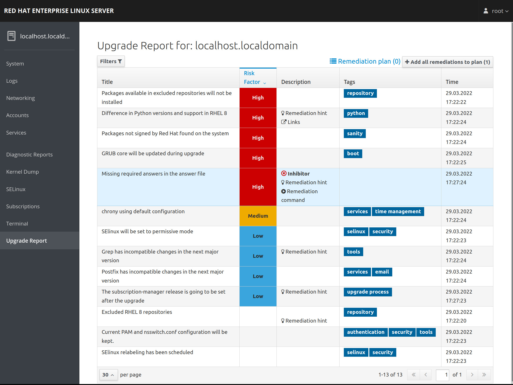
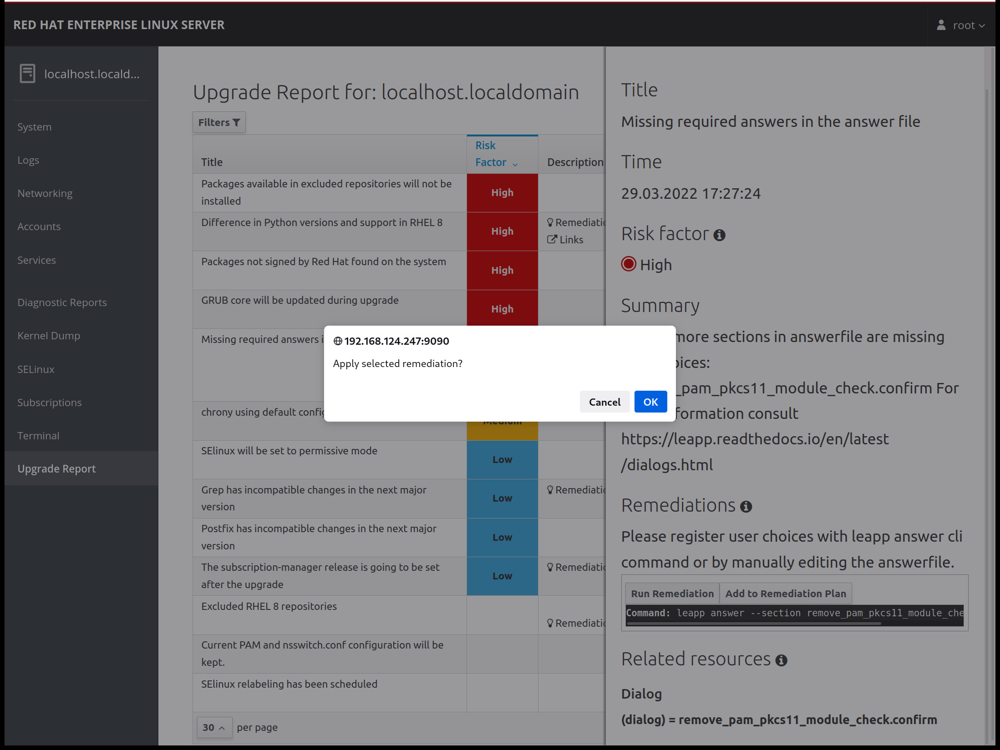

= Demo Leapp

The Leapp upgrade tooling takes a number of steps to complete the update between
major versions of Red Hat Enterprise Linux. I recommend you review the Red Hat documentation
on

- https://access.redhat.com/documentation/en-us/red_hat_enterprise_linux/8/html/upgrading_from_rhel_7_to_rhel_8/planning-an-upgrade_upgrading-from-rhel-7-to-rhel-8[Planning an Upgrade from RHEL7 to RHEL8]
- https://access.redhat.com/documentation/en-us/red_hat_enterprise_linux/9/html/upgrading_from_rhel_8_to_rhel_9/index[Upgrading from RHEL 8 to RHEL 9]

Typically the steps required are

* Environment setup
* Pre-upgrade report generation and review
* 2 phase upgrade 
** in place system preperation
** boot to temporary RHEL8/RHEL9 initramfs to complete upgrade
* Post upgrade environment validation

*NOTE* We don't currently demo upgrading from RHEL7 thru RHEL8 to RHEL9 due to complications
on how network management has changed between releases.

== Subscribe your RHEL VM

If you've converted a Centos environment to Red Hat Enterprise Linux it will already have a valid
Red Hat subscription attached. If you're starting with a fresh RHEL image you will need to make
sure it is correctly entitled in order to pull down the required packages

[source,bash]
----
cd ansible

ansible-playbook  -i hosts rhsm_subscribe.yaml
----

== Environment Setup and Pre-Upgrade Report

We first need to make sure we've got the required repositories and requirements
for leapp to run.

[source,bash]
----
cd ansible

ansible-playbook  -i hosts setup-leapp.yaml 
----

== Pre-upgrade for RHEL7 to RHEL8

For RHEL 7 to RHEL 8 We're then going to leverage a 
https://github.com/mrjoshuap/ansible-leapp[leapp role] from Ansible Galaxy
developed by link:https://github.com/mrjoshuap[Josh Preston] from Red Hat.

We also need to pull down the latest 
https://access.redhat.com/articles/3664871[leapp metadata tgz]
and install this into the link:../ansible/files[files]
directory. The Leapp tool can pull this down automatically from Red Hat, but Josh's playbook installs this manually.

You can then kick off an initial Leapp run via 

[source,bash]
----
ansible-galaxy  install -r requirements.yaml

ansible-playbook  -i hosts run-leapp.yaml
----

== Pre-upgrade for RHEL8 to RHEL9

At present John's scripts above haven't been updated for RHEL8x -> RHEL9 so we'll need to
perform this manually

[source,bash]
----
# Login to our host via SSH
ssh leapp2rhel

# Make sure we've got the required tools and recent patches
dnf check-update
dnf install -y leapp-upgrade cockpit-leapp
systemctl enable --now cockpit.socket
dnf -y upgrade kernel && reboot

# Once rebooted log back in over SSH
ssh leapp2rhel

# Run a pre-upgrade
leapp preupgrade --target 9.0

----

== Review the pre-upgrade report 

Once completed can browse the https://access.redhat.com/documentation/en-us/red_hat_enterprise_linux/8/html/upgrading_from_rhel_7_to_rhel_8/assembly_preparing-for-the-upgrade_upgrading-from-rhel-7-to-rhel-8[generated preupgrade report] under link:../ansible/leapp-reports/leapp2rhel/var/log/leapp/leapp-report-preupgrade.txt[leapp-report-preupgrade.txt] or use cockpit on port 9090 (http://<your_vm_ip>:9090) to view and
remediate potential issues.

== Remediate upgrade blockers

=== 8 -> 9
Currently the RHEL 8 to RHEL 9 upgrade appears to produce no blockes, even if
we initially started with a Centos 8.x environment.

=== 7 -> 8 -> 9
There is an issue if
you try to upgrade from RHEL or Centos 7 thru 8 into RHEL 9 due to changes
in the way we manage networks that require manual intervention.

=== 7 -> 8 
With our default Centos to RHEL 7 migrated image we get a blocker due to a pam pkcs module
that requires the following response in order for the upgrade to proceed

[source,bash]
----
leapp answer --section remove_pam_pkcs11_module_check.confirm=True
----

Or you can use the cockpit interface to select and apply the required remediation

There are usually a number of additional post upgrade recommendations

 - Please run "alternatives --set python /usr/bin/python3" after upgrade
 - Remaining Centos 7 package "yum-plugin-fastestmirror"
 - Grub core isn't updated due to the install location on a legacy environment

== Complete the RHEL upgrade

Once you've remedated any blockers and undertstand the other potential risks/issues you can run the
the following via Ansible for our RHEL 7 to RHEL8 upgrade

[source,bash]
----
ansible-playbook  -i hosts -e "leapp_skip_upgrade=no" run-leapp.yaml

ssh leapp2rhel reboot
----

or login to your demo environment and run to upgrade from RHEL 7 or RHEL 8

[source,bash]
----
ssh leapp2rhel

leapp upgrade

reboot
----

If you want monitor the _leapp upgrade_ process via a second terminal session run the following

[source,bash]
----
ssh leapp2rhel tail -f /var/log/leapp/leapp-upgrade.log
----

And if you want to monitor the initramfs part of the upgrade I recommend you
connect a virtual console to your demo VM or host

[source,bash]
----
virsh console ${VM_NAME}
----

== Post upgrade environment verification

Once completed make sure you follow the post upgrade verification steps for

- https://access.redhat.com/documentation/en-us/red_hat_enterprise_linux/8/html/upgrading_from_rhel_7_to_rhel_8/verifying-the-post-upgrade-state-of-the-rhel-8-system_upgrading-from-rhel-7-to-rhel-8[rhel-7-to-rhel-8] or
- https://access.redhat.com/documentation/en-us/red_hat_enterprise_linux/9/html/upgrading_from_rhel_8_to_rhel_9/performing-post-upgrade-tasks-rhel-8-to-rhel-9_upgrading-from-rhel-8-to-rhel-9[rhel-8-to-rhel-9].

eg. one critical task for RHEL8 is to un-pin the OS version from RHEL 8.4 to allow upgrades, and set https://access.redhat.com/documentation/en-us/red_hat_enterprise_linux/8/html/upgrading_from_rhel_7_to_rhel_8/applying-security-policies_upgrading-from-rhel-7-to-rhel-8[SELinux to Enabled].

[source,bash]
----

# Confirm we're running a pinned release of RHEL 8.4
subscription-manager release

# Now patch the system to the latest updates from Red Hat
subscription-manager release --unset
dnf update

----

Alternatively you might decide to use our EUS release to continue usin RHEL 8.4

[source,bash]
----

subscription-manager repos --enable  rhel-8-for-x86_64-baseos-eus-rpms \
  --enable rhel-8-for-x86_64-appstream-eus-rpms
dnf update

----

link:../README.adoc[Return]
